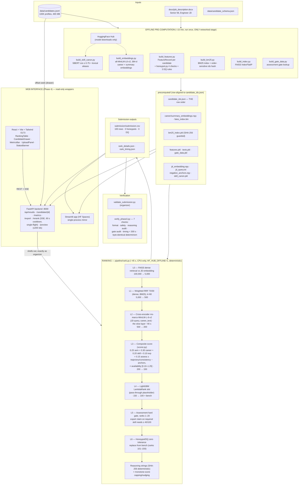

# Glasshouse — System Architecture

Full-system diagram. Renders natively on GitHub (Mermaid).

## End-to-end system



## Funnel at a glance

```
100,000 ──L0 FAISS──▶ 5,000 ──L1 hybrid──▶ 500 ──L2 cross-enc──▶ 200
  ──L3 composite──▶ 150 ──L4 (pass-thru)──▶ 100 + bench
  ──L5 gate (top-20)──▶ ──L6 honeypot/DQ swap──▶ final 100 + reasoning
```

## Key invariants (do not break)

1. Determinism — no unseeded randomness; SHA-256, never builtin `hash()`.
2. Row alignment — everything keys off `candidate_ids.json`; BM25 carries an
   order-sensitive hash and rank.py refuses to run on mismatch.
3. Offline rank path — `HF_HUB_OFFLINE=1` set before any HF import.
4. Validator rules — 100 rows, monotone scores, id-ascending ties.
5. Zero tolerance — no honeypot/DQ in the final 100, ever.
6. `contracts.py` is a locked interface between phases.
7. 300 s budget — L2 cross-encoder dominates; don't grow `--topk-l1` casually.
